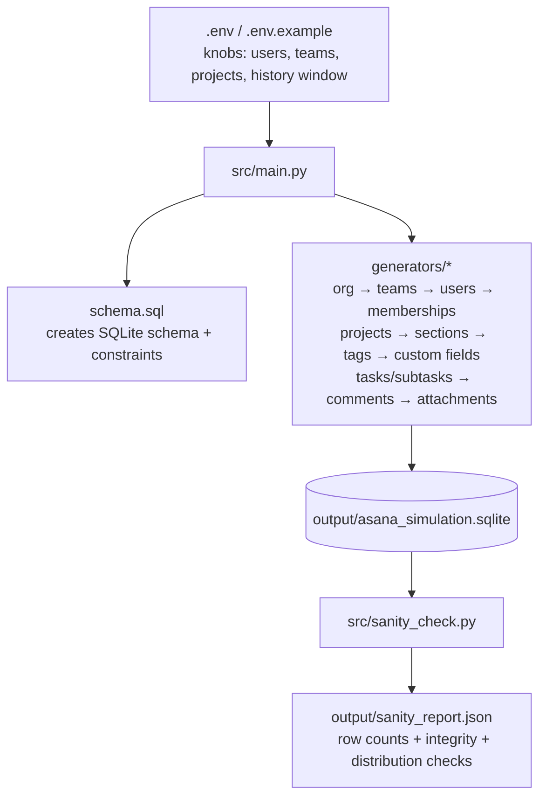

# Asana-Style Enterprise Workspace Simulator (SQLite)

A reproducible **enterprise-scale** dataset generator for an Asana-like project management workspace.

This project is designed for:

- **RL / agent evaluation** (planning, scheduling, prioritization, triage, collaboration)
- **Data engineering / analytics** (relational modeling, distributions, integrity constraints)
- **Product simulations** (realistic task lifecycles, teams, projects, comments, custom fields)

## Why this stands out

- **Enterprise realism, not toy data**: multi-department org structure, teams, projects, task/subtask hierarchies, collaboration artifacts.
- **Relational correctness**: explicit FKs + CHECK constraints; generators are built to satisfy them.
- **Measurable quality**: automated sanity checks produce `output/sanity_report.json`.
- **Optional LLM enrichment**: task titles/descriptions can be refined using Groq, but the repo runs fully offline.

## Dataset at a glance 

From the latest `output/sanity_report.json`:

- **Users**: 7000
- **Projects**: 240
- **Tasks**: 52,734
- **Unassigned task rate**: ~15.0%
- **No due date rate**: ~9.8%
- **Custom field values per task (avg)**: ~2.71

## System architecture



## Quickstart

1) Install deps

```bash
pip install -r requirements.txt
```

2) Create `.env`

```bash
copy .env.example .env
```

3) Generate the dataset

```bash
python src/main.py
```

4) Validate quality

```bash
python src/sanity_check.py
```


## Optional: LLM-enriched task text (Groq)

Set in `.env`:

- `USE_LLM_TEXT=1`
- `GROQ_API_KEY=...`


## Configuration knobs

All configuration is via `.env` (see `.env.example`):

- `TARGET_USERS` (default 7000)
- `TEAMS_COUNT` (default 80)
- `PROJECTS_COUNT` (default 240)
- `AVG_TASKS_PER_PROJECT` (default 260)
- `HISTORY_DAYS` (default 180)

## Explore the DB (examples)

```sql
-- Workload
SELECT assignee_user_id, COUNT(*) AS tasks
FROM tasks
GROUP BY 1
ORDER BY tasks DESC
LIMIT 20;

-- Overdue open tasks
SELECT name, due_date
FROM tasks
WHERE completed = 0 AND due_date IS NOT NULL AND due_date < date('now')
ORDER BY due_date ASC
LIMIT 50;
```
